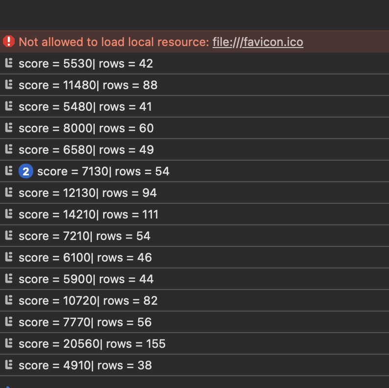
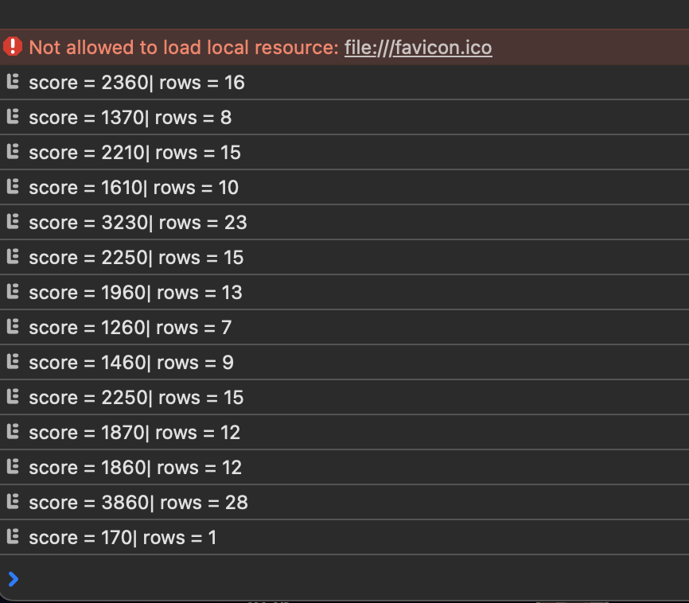
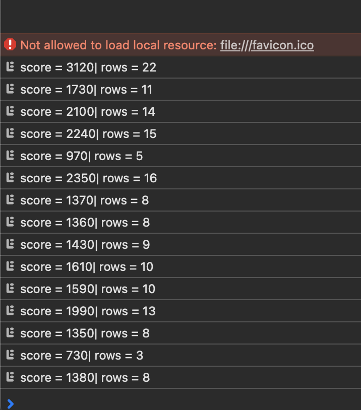
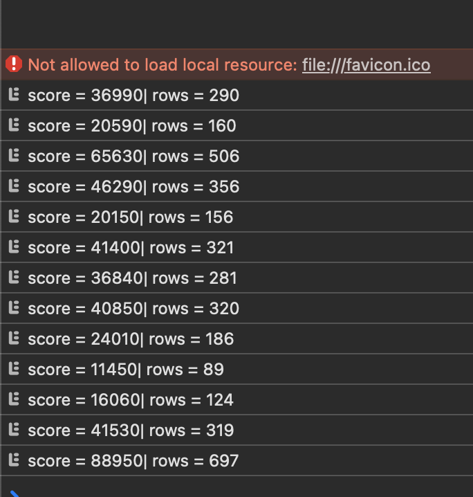

````markdown
# My Tetris AI Report

> In this assignment I had to:
>
> 1. Understand the JavaScript game and **fix bugs** in the heuristic agent.  
> 2. **Improve the heuristic** by tuning the weights and adding new features.  
> 3. Implement a **new agent using Beam Search**.  
> 4. Write a **report with results and conclusions**.
>
> This is my report of how I did it.

---

## 1. Fixing the Heuristic Agent (`heuristic_agent.js`)

### 1.1 What the original heuristic was supposed to do

The heuristic agent evaluates each possible move by simulating the drop of the current piece, extracting a few features from the resulting board, and combining them with weights:

- total (aggregate) height of all columns  
- number of completed lines  
- number of “holes” (empty cells under filled ones)  
- bumpiness of the surface (difference between neighbouring column heights)

The move with the best heuristic score is then played.

### 1.2 Bugs I found

Problems:

- **EvaluateBoard**: 
   - The order of loops is mistaken. Switch x with y in the for loops to compute values of column_height and aggreagte_height correctly .
   - It should be checked if board[x][y] is also null or undefined, as board can take any type of these values.

- **getDropPosition**:
   - It should be checked if the piece can even be placed on the first row.

- **getPossibleMoves**:
   - Dues to the methods of how differennt shapes are saved in bin values, x coord. does not represent the real column from where the piece starts. Therefore, x coordinate range must be extended from -3 to nx.
   - If the return of getDropPosition is -1, then value can't be placed anywhere on that column
   - In JS, attributing a piece to another value creates a shallow (not a deep) copy. Therefore, every tiem piece is modified, all other pieces in the moves list also change. In order to fix it, it must be made sure that a piece is a deep copy in moves list.

### 1.3 What changed after the fixes

After these changes I ran several games with the original weights. 

- Scores and cleared rows correlate much more reasonably.  
- There are no crashes or obviously impossible numbers.  
- The agent can play long, stable games purely with the fixed heuristic (Up to 150+ rows)

> **Screenshot 1 – Bug-fixed heuristic agent results**  
> 

---

## 2. Tuning the Heuristic Weights

With the tuned weights, the agent:

- kinda works worse

Example results from **Screenshot 2**:

- `score = 2360 | rows = 16`  
- `score = 1370 | rows = 8`  
- `score = 2210 | rows = 15`

> **Screenshot 2 – Results after weight tuning**  
> 

---

## 3. Adding a New Feature: `maxHeightColumn`

### 3.1 Why I added it

Even after the weight tuning, I noticed a typical failure pattern:

- One column grows dangerously high,  
- the others stay low,  
- and a single bad piece ends the game.

Aggregate height alone does not fully capture this. I wanted the heuristic to directly “see” the tallest column, so I introduced a new feature:

> **`maxHeightColumn` – the maximum height of any column.**

### 3.2 How I implemented it

While scanning the board for column heights I now also track the maximum:

```js
for (let x = 0; x < nx; x++) {
  maxHeightColumn = Math.max(maxHeightColumn, columnHeights[x]);
}
```

In the final evaluation:

```js
let score =
  wAggregate * aggregateHeight +
  wComplete  * completeLines   -
  wHoles     * holes           -
  wBump      * bumpiness       -
  wMaxHeight * maxHeightColumn; // new term
```

Here `wMaxHeight` is a positive weight, so through substraction very tall columns are heavily penalized.

### 3.3 How it changed the agent’s behaviour

With `maxHeightColumn` added:

- The agent actively avoids creating a single towering column.
- It spreads the pieces more evenly across the board.
- It is more willing to clear lines earlier instead of “greeding” for a perfect setup.

In **Screenshot 3** I logged several runs after adding this feature:

- `score = 3120 | rows = 22`
- `score = 2350 | rows = 16`
- `score = 3860 | rows = 28`

The scores are on average higher and the style is much more conservative. This is intentional: the heuristic now encodes the idea that reaching the top is the worst thing that can happen.

> **Screenshot 3 – Heuristic with `maxHeightColumn`**  
> 

---

## 4. My New Agent: Beam Search (`agentBeam.js`)


At each decision step, my agent does:

1. **Generate all moves for the current piece**

   - For every rotation and valid `x` position I simulate the drop and obtain a new board.

2. **Look one piece ahead**

   - For each of these boards, I take the next piece and generate all its legal moves.
   - I evaluate each second-step board using the improved `evaluateBoard` (which now includes `maxHeightColumn`).
   - For each first-step move, I keep the **best** score that can be obtained after placing the second piece.

3. **Apply the beam**

   - I sort the first-step moves by their look-ahead score.
   - I keep only the top `k` boards (the **beam width**).
   - From those, I choose the best move and send it to the game.

This gives a good trade-off:

- It explores more than a plain greedy strategy,
- but it avoids the exponential explosion of full search.

### 4.3 What I observed

With Beam Search plus my improved heuristic, the agent behaves much more intelligently:

- It often prepares wells for upcoming I-pieces.
- It avoids moves that look good for the current piece but have terrible follow-ups.
- Games tend to last longer and the board stays under control for more time.

In **Screenshot 4** I captured some of these runs:

- `score = 36990 | rows = 290`
- `score = 20590 | rows = 160`
- `score = 65630 | rows = 506`
- and similar stable sequences.

The absolute numbers depend on the beam width and runtime, but qualitatively the behaviour is clearly more “planned” than in the purely greedy agent.

> **Screenshot 4 – Beam Search agent logs**  
> 

---

## 5. Final Conclusions
- In this report I tried to tell step by step: from understanding and fixing the original agent, through heuristic tuning, to implementing a smarter search-based agent.
- I also included screenshots of the console logs that show how the behaviour changed with each modification.

Overall, I turned the original heuristic player into a safer and more strategic Tetris agent.
````
